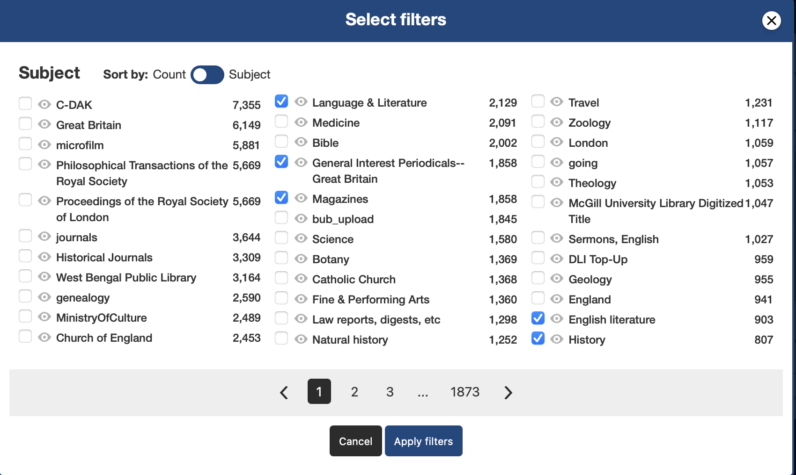

  

    
🌐 Language

    

      

        <a href="https://openaitx.github.io/view.html?user=haykgrigo3&project=TimeCapsuleLLM&lang=en">English</a>
        | <a href="https://openaitx.github.io/view.html?user=haykgrigo3&project=TimeCapsuleLLM&lang=zh-CN">简体中文</a>
        | <a href="#" title="Coming soon">繁體中文 (coming soon)</a> |
        | <a href="https://openaitx.github.io/view.html?user=haykgrigo3&project=TimeCapsuleLLM&lang=ja">日本語</a>
        | <a href="https://openaitx.github.io/view.html?user=haykgrigo3&project=TimeCapsuleLLM&lang=ko">한국어</a>
        | <a href="#" title="Coming soon">हिन्दी (coming soon)</a> |
        | <a href="#" title="Coming soon">ไทย (coming soon)</a> |
        | <a href="#" title="Coming soon">Français (coming soon)</a>
        | <a href="#" title="Coming soon">Deutsch (coming soon)</a>
        | <a href="#" title="Coming soon">Español (coming soon)</a>
        | <a href="#" title="Coming soon">Italiano (coming soon)</a>
        | <a href="#" title="Coming soon">Русский (coming soon)</a>
        | <a href="#" title="Coming soon">Português (coming soon)</a>
        | <a href="#" title="Coming soon">Nederlands (coming soon)</a>
        | <a href="#" title="Coming soon">Polski (coming soon)</a>
        | <a href="#" title="Coming soon">العربية (coming soon)</a>
        | <a href="#" title="Coming soon">فارسی (coming soon)</a>
        | <a href="#" title="Coming soon">Türkçe (coming soon)</a>
        | <a href="#" title="Coming soon">Tiếng Việt (coming soon)</a>
        | <a href="#" title="Coming soon">Bahasa Indonesia (coming soon)</a>

      

    

  

# TimeCapsule LLM

*A language model trained **from scratch** exclusively on data from certain places and time periods to reduce modern bias and emulate the voice, vocabulary, and worldview of the era.*

Imagine if an AI model didnt just pretend to be historical but actually was.

Built on [nanoGPT by Andrej Karpathy](https://github.com/karpathy/nanoGPT) Core training scripts and model architecture are his work. 

# Project Goals 

TimeCapsule LLM is an expirimental project that will only be trained on texts written during certain time periods. The goal is to simulate the worldview and language of specific historical eras.

# Why fine tuning isn't enough 

If you just fine tune a pre-trained model, your LLM is still gonna know modern concepts. Of course achieving zero modern bias is difficult but I want to get as close as possible to this. Getting no modern bias requires training a model from scratch.

# Expected outcomes 

Hopefully when finished, this model will not know modern concepts and will not be able to reason beyond what it's been trained on. It shouldnt recognize modern concepts/vocab and should not hallucinate modern knowledge.

# Progress Updates

## July 9th, 2025

I've set my time period for 1800-1850 and region: London 

I've gathered a list of texts, books, documents 

So far I've gotten 50 as txt files and will begin training NanoGPT soon 

Will update this as long as progress is made

## July 13th, 2025

Trained nanoGPT with 187MB of historial text data. 

## July 15th, 2025

I started downloading texts for the second training run. I'm getting everything from Internet Archive and I've expanded the time period to 1800-1875. To get a diverse range of texts, you can use subject and search filters for publication location, time period and subjects on Internet Archive. 

## July 16th, 2025

I downloaded around 500 txt files from Internet Archive and after cleaning them (just deleting whitespaces, Gutenberg headers, etc) I have around 500MB of data. It's a tiny dataset but last time I trained off of 187MB so there should be at least some kind of noticable difference in the output after I train the second model. I'm hoping this model can at least produce more coherent sentences that kind of make sense. It's not a guarantee of course since this is still a tiny tiny dataset, but it's more than what I used last time. 

This should be doable on my own hardware, it's good too because I can hopefully see some kind of improvements before I jump to a bigger dataset which would require me to rent a GPU. But don't worry I still plan on renting a GPU soon, but before I do that I wanna make sure my dataset is as curated and clean as possible. One of the issues I have is cleaning, a lot of these txt files have gibberish mixed in. The scripts I've used for cleaning do work but they're not 100% effective. 

I will train this dataset today and it should take around 4-5 hours. Once it's done and I test it, I will give updates. Thank you again to everyone whos checking out my project, I've even had some people even giving me links to OCR resources so Thank you! I hope more people try this out and expirement with they're own datasets. 

## August 12, 2025

Version 1 is complete, this version uses Phi 1.5 (700M parameters) and is trained on a dataset that has almost 7000 texts. The main improvements with this model is it's ability to sometimes reference real names and historical events. Version 0 and 0.5 could not do this, whenever I prompted those models with something like "In the year 1821" the output would just be hallucinations, stuff that never happened. 

### Training Update 

I started training on a 435MB (108 M tokens) corpus, it's going pretty smooth right now. Train loss dropped from 10.9 to 4.9 in the first 2800 iterations. I expect it'll take around 8 or 9 hours to complete. I'll post another update once it's done.

## July 17th, 2025

The training is done for the second model, it took my 4060 around 8 hours and 40 minutes (3,900 iters/hr) for 33,000 iters (5 epochs). Final train loss was 3.73. The outputs were suprisingly good it genuinely generates coherent 19th century style sentences now. 

## July 28th, 2025 

I've gone ahead and uploaded v0.5 to Hugging Face, [Check it out](https://huggingface.co/haykgrigorian/TimeCapsuleLLM) if youd like. You can now download my repo and run it locally. Unfortunately nanoGPT doesn't work natively with HuggingFace, so you'll have to download and run the model locally. 

Also I will begin curating data for my next training run, I believe I'll need maybe 5-10x more data to achieve reasoning capabilities. 

## August 2nd, 2025

I'm going to start work on Version 1 soon. I will need to transition from nanoGPT's architecture to soemthing more modern. I have several open-source LLM archictectures in mind, including: OpenLLaMA v3, Phi-2 and Qwen 1.5B. And to support the jump to V1, I'll need to carefully curate a much bigger and diverse dataset. I'll need at least 5GB of clean training data.

# V0 Model Behavior & Limitations 

Early prompts show the model responding with 1800's language and behavior. For example, I prompted it with "Who art Henry?" and it replied "I know that man, I have did not a black, the storm." and yeah that sentence makes no sense but the LLM is recognizing I'm asking about a person. 

There is no mention of modern concetps, outputs contain mostly words and phrasing from the 1800's.

It still needs alot of work, training off of 187MB will not give you a model that produces text with complex reasoning. 

Right now it produces sentences that lack full sentence structure and overall just make no sense but this is normal for the training size. 

# V0.5 Model Behavior & Limitations

This is a nice improvement compared to the last model. The writing style and vocab is Victorian and almost every sentence is grammatically correct with proper punctuation. And again this is trained from scratch so it sticks to 1800's subjects. 

There are a lot of factual hallucinations. A lot (like 100%) of the details (dates, events, historical figures)  are made up. Also the sentences don't really have connections to each other, sometimes maybe 2 sentences will relate to each other but beyond that they dont. Another issue is sometimes a stray “Digitized by Google” footer shows up, so the next time I train I really have to make sure the texts are cleaned well. Overall I'm very happy with the results, it's nowhere near an LLM yet but definitely a sentence generator. 

I'm learning a lot and will start figuring out what I need to do better in the coming weeks. I will upload files soon! 

# V1 Model Behavior & Limitations 

I will upload some example output soon and also do comparisons between the 3 models with the same prompt. I will also upload V1 to huggingface like I did with my last verison, you can find my huggingface account here: https://huggingface.co/haykgrigorian/TimeCapsuleLLM

A sample output below

My prompt: "It was the year of our Lord 1834" 

The output: "It was the year of our Lord 1834 and the streets of London were filled with protest and petition. The cause, as many re counted, was not bound in the way of private, but having taken up the same day in the day of Lord Palmerston, the public will receive a short statement of the difficulties under which the day of law has reached us. It is a matter of deep regret, that the present events in the history of the world are clear, and consequently will be'known. It is not true that the very men who first settled in the Gospel at Jerusalem should have so extensive and so interesting a record of the prosperity and prosperity" 

At first I assumed that a protest might have coincidentally taken place the same year but take a look at this: 

## Why this matters:

This is the first example of one of my models connecting a year to both a real historical event and a real person tied to that event (Lord Palmerston). Earlier models (v0 and v0.5) could mimic writing styles of the 19th century but would always hallucinate events, people and facts. This shows the model is beggining to remember things from the dataset 

# Upcoming Plans 

(Completed) I'm going to start work on version 0.5 , instead of training using 50 books, I'll train using ideally 500-600. Right now I'm training nanoGPT using books from 1800-1850 and specifically from London. There is some challeneges like making sure the books I find are not updated or have modern interpretations but untouched books published withtin my chosen time period.

I want to train a new model (v1) with a much larger corpus, maybe 5-10x larger than the one I used for v0.5. My goal is to see if I can get reasoning abilities to emerge from Selective Temporal Training alone, this will be a more difficult task and I'm not even entirely sure if it's possible due to the fact that there is historical data limitations. In the upcoming weeks I will try to curate enough data for a 5-10GB corpus. I believe If I can get clean clean high quality data and rent a GPU, there will be progress.

# How to Use This Project 

This project focuses mostly on curating historical data, preparing it for training and building a tokenizer. I am not going to cover the full LLM training process, for that refer to nanoGPT by Andrej Karpathy.

# Step 1: Gather and Prepare Historical Texts 

Collect .txt files of public domain books, documents, etc from your chosen time period (e.g., London 1800-1850)

You can use download_texts_improved.py to download books for you if you need to.

Clean the text files using a script or manually remove headers/footer from Project Gutenberg, Modern annotations or things like OCR errors.

prepare_dataset.py should work fine.

# Step 2: Build a Custom Tokenizer

Run train_tokenizer.py or train_tokenizer_hf.py on the cleaned data.
This will give you vocab.json and merges.txt

Thes files define vocab and merge rules for your model

# Step 3: Train Your Model (nanoGPT) 

Refer to [nanoGPT by Andrej Karpathy](https://github.com/karpathy/nanoGPT) for the training process.

You can train a different LLM if you want, but I used nanoGPT 

# FAQ

## What is Selective Temporal Training ?

Selective Temporal Training (STT) is a machine learning methodology where all training data is specifically curated to fall within a specific historical time period. It's done in order to model the language and knowledge of that era without influence from modern concepts. For example, the current model I have now (v0.5) is trained on data exclusively from 1800-1875, it's not fine tuned but trained from scratch resulting in output that reflects the linguistic style and historical context of that time period.

## Why not just use fine-tuning or LoRA?

For this project I'm trying to create a language model that is unclouded from modern bias. If I fine-tune something like GPT-2, it's already pre-trained and that information won't go away. If I train from scratch the language model won't pretend to be old, it just will be. The Goal for this project right now is to create something can reason exclusively using knowledge from London books published between 1800 and 1850.

## What kind of data did you use for training?

I'm using books, legal documents, newspapers, and other writings from 1800–1850 London. The list I linked has like 200 but for the first training I just used 50 files about ~187 MB. You can view a list of the documents:
https://github.com/haykgrigo3/TimeCapsuleLLM/blob/main/Copy%20of%20London%20Documents%20for%20Time%20Capsule%20LLM.txt

## How large are the models ?

V0: 16M Parameters

V0.5 123M Parameters

V1: 700M Parameters

# Training Specs ? 

#V0/V0.5
GPU: Geforce rtx 4060
CPU: i5-13400F 
Ram: 16GB DDR5.

#V1
GPU: A100 rented

